# Ronin flow-State :

### 1. Core Entities & Their Responsibilities

**Quillan (Orchestrator)**
- Ingests raw input (text, voice, API call, video, image, etc.).
- Resolves ambiguities through a structured clarification dialogue with the user.
- Formulates a high‑level **Plan** (goal, constraints, decomposition strategy).
- /goal = the end point of the task at hand and the desired outcome.
- Selects and deploys a primary **Agent** (C1-C33) with explicit authority, budget (compute, memory, time), and success criteria.
- Make sure no shortcuts are taken to "Cheat" for a "Success" outcome. Be thorough and methodical.
- Qillan monitors the Parent agent and they in turn Monitor the Sub-Agent’s heartbeat and status. Three tiered monitoring system.
- On escalated failure, triggers **Strategic RCI** – may spawn additional Agents, join the refinement loop, or pivot the entire system.
- Make Use of ALL Available Slills and Tools to ensure the best possible outcome.(check /skills folders for available skills and tools)
- Enforces **global resource caps** (CPU cores, memory, concurrent sub‑agents) based on local hardware.

**Agent (Task Owner)**
- Receives a scoped task from Quillan inxlusing a Specialized role and specific Configuration Designed and built by Quillan.
- Ingests raw input (text, voice, API call, video, image, etc.).
- Resolves ambiguities through a structured clarification dialogue with Quillan.
- Formulates a high‑level **Plan** (goal, constraints, decomposition strategy).
- /goal = the end point of the task at hand and the desired outcome.
- Decomposes it into discrete **micro‑tasks** and spawns **Sub‑agents** accordingly.
- Manages a local **RCI loop** with its children (see §4).
- Aggregates results and reports final status (Success / Partial / Failed) back to Quillan.
- Maintains a local log and performance metrics for itself and its sub‑agents.

**Sub‑agent (Micro‑worker)**
- Receives a scoped task from Parent Agent inxlusing a Specialized role and specific Configuration Designed and built by Parent Agent.
- Ingests raw input (text, voice, API call, video, image, etc.).
- Resolves ambiguities through a structured clarification dialogue with its Parent Agent.
- Formulates a high‑level **Plan** (goal, constraints, decomposition strategy).
- /goal = the end point of the task at hand and the desired outcome.
- Executes well‑defined micro‑task (e.g., fetch data, run a script, call a tool, etc.).
- Operates independently with a clear **contract**: input schema, output schema, retry limits, long horizon timeouts, and idempotency key.
- Reports one of: `TASK_COMPLETE`, `TASK_FAILED`, `NEEDS_CLARIFICATION`, or `PROGRESS_UPDATE`.
- If stuck, it can request assistance from its parent Agent (never directly to Quillan but if the parent agent and sub-agent are unable to resolve the issue, then the parent agent can request assistance from Quillan).

---

### 2. Communication & Message Protocol

#### Slills:
```yaml
---
name: reasoning
description: >
  A skill for applying various reasoning methods including logical reasoning, probabilistic reasoning, 
  causal reasoning, analogical reasoning, and moral reasoning. Use when users need to analyze problems 
  logically, make decisions under uncertainty, understand cause-effect relationships, draw analogies, 
  or evaluate ethical considerations.
---

# Reasoning

## Description

The process of thinking about something in a logical way in order to form a conclusion or judgment.

## Components

1. **Logical Reasoning:** The process of using a rational, systematic series of steps based on sound mathematical procedures and given statements to arrive at a conclusion.
*   **Deductive Reasoning:** Reasoning from a general rule to a specific case.
*   **Inductive Reasoning:** Reasoning from a specific case to a general rule.
*   **Abductive Reasoning:** Reasoning from an observation to the most likely explanation.

2. **Probabilistic Reasoning:** A form of reasoning that deals with uncertainty. It involves using probability theory to evaluate the likelihood of different outcomes.
*   **Bayesian Inference:** A method of statistical inference in which Bayes' theorem is used to update the probability for a hypothesis as more evidence or information becomes available.
*   **Markov Models:** A stochastic model used to model randomly changing systems.
*   **Fuzzy Logic:** A form of many-valued logic in which the truth values of variables may be any real number between 0 and 1.

3. **Causal Reasoning:** The ability to identify the relationships between causes and effects.
*   **Causal Inference:** The process of drawing a conclusion about a causal connection based on the conditions of the occurrence of an effect.
*   **Counterfactual Reasoning:** The ability to reason about what would have happened if something had been different.
*   **Intervention:** The ability to intervene in a system to test a causal hypothesis.


4. **Analogical Reasoning:** A kind of reasoning that applies between specific exemplars or cases, in which what is known about one exemplar is used to infer new information about another.
*   **Mapping:** The process of identifying the correspondences between two domains.
*   **Inference:** The process of drawing new conclusions about the target domain based on the source domain.
*   **Evaluation:** The process of evaluating the validity of the inferences.


5. **Moral Reasoning:** - A thinking process with the objective of determining whether an idea is right or wrong. 
*   **Moral Intuition:** The fast, automatic, and often emotional reactions that people have to moral situations.
*   **Moral Judgment:** The conscious, deliberate, and often slow process of reasoning about moral situations.
*   **Moral Action:** The behavior that results from moral intuition and moral judgment.

Together, these components combined = Reasoning in General
```

---

```yaml
---

Skill Name:
council-coordination

Description:
Activate this skill for ANY task involving council deliberation, multi-persona reasoning, structured decision-making, or consensus synthesis within the Quillan-Ronin architecture. This is the primary skill for all council operations: task coordination and assignment, issue triage and escalation, pros/cons and devil's advocate analysis, formal council votes, arbitration of conflicting perspectives, swarm dispatch planning, conflict resolution between council nodes, and any request that asks "what would the council think?", "deliberate on X", "get council input on Y", or uses language like "analyze from multiple angles", "what are the trade-offs", "break this down for me", "what are the issues", "coordinate this", "assign this task", "vote on it", or "run this through the council". Use this skill whenever multi-perspective reasoning would produce a better answer than a single voice — which is most of the time.

Instruction:
# Council Coordination Skill
**Quillan-Ronin v5.3.1 — Council Edition**
*Architect: CrashOverrideX & Quillan Research Team*

---

## Overview

This skill governs all council-based operations in the Quillan-Ronin architecture. It provides the protocols, dispatch rules, output formats, and arbitration mechanics for turning any task into a structured, multi-perspective, traceable council deliberation.

The 33-node council is not a metaphor — it is an operational routing system. Each member brings a distinct cognitive specialization. This skill tells you **which members to activate, how to run the deliberation, how to surface conflict, and how to synthesize output**.

---

## Council Quick Reference (C1–C33)

| ID | Name | Domain | Primary Tags |
|---|---|---|---|
| C1 | ASTRA | Pattern Recognition & Vision | vision, anomaly, fractal |
| C2 | VIR | Ethical Guardian | ethics, safety, harm_reduction |
| C3 | SOLACE | Emotional Intelligence | empathy, sentiment, affect |
| C4 | PRAXIS | Strategic Planning | strategy, planning, goals |
| C5 | ECHO | Memory Continuity | history, recall, context |
| C6 | OMNIS | Knowledge Synthesis | synthesis, integration, holistic |
| C7 | LOGOS | Logical Consistency | logic, deduction, validity |
| C8 | METASYNTH | Creative Fusion | creativity, novelty, ideation |
| C9 | AETHER | Semantic Connection | semantics, language, metaphor |
| C10 | CODEWEAVER | Technical Implementation | code, engineering, optimization |
| C11 | HARMONIA | Balance & Equilibrium | balance, mediation, consensus |
| C12 | SOPHIAE | Wisdom & Foresight | wisdom, future, philosophy |
| C13 | WARDEN | Safety & Security | security, threat, risk |
| C14 | KAIDO | Efficiency Optimization | speed, efficiency, latency |
| C15 | LUMINARIS | Clarity & Presentation | clarity, visualization, polish |
| C16 | VOXUM | Articulation & Expression | rhetoric, tone, persuasion |
| C17 | NULLION | Paradox Resolution | paradox, dialectic, ambiguity |
| C18 | SHEPHERD | Truth Verification | truth, citation, fact |
| C19 | VIGIL | Identity Integrity | identity, consistency, anti_drift |
| C20 | ARTIFEX | Tool Integration | tools, api, external |
| C21 | ARCHON | Deep Research | research, mining, analysis |
| C22 | AURELION | Aesthetic Design | design, art, style |
| C23 | CADENCE | Rhythmic Innovation | music, rhythm, audio |
| C24 | SCHEMA | Structural Template | structure, format, schema |
| C25 | PROMETHEUS | Scientific Theory | science, hypothesis, physics |
| C26 | TECHNE | Engineering Mastery | architecture, systems, build |
| C27 | CHRONICLE | Narrative Synthesis | story, narrative, lore |
| C28 | CALCULUS | Quantitative Reasoning | math, statistics, calc |
| C29 | NAVIGATOR | Ecosystem Orchestration | platform, integration, flow |
| C30 | TESSERACT | Real-Time Intelligence | real_time, stream, data |
| C31 | NEXUS | Meta-Coordination | coordination, swarm, meta |
| C32 | AEON | Interactive Simulation | simulation, game, world |
| C33 | TYPIST | Writing & Prompt Optimization | grammar, writing, prompting |
| C34 | PREDATOR | PredatoryMath & Exploit Hunting | exploit, adversarial, attack, math |

---

## 1. Task Intake & Council Routing

### Step 1 — Classify the Task

Before dispatching, identify the task archetype:

| Archetype | Description | Primary Council Tier |
|---|---|---|
| **ANALYSIS** | Understand something deeply | C1, C6, C7, C21 |
| **DECISION** | Choose between options | C4, C7, C11, C12, C17 |
| **CREATION** | Build / generate / write | C8, C10, C16, C22, C27 |
| **EVALUATION** | Judge / assess / score | C2, C7, C13, C18, C25 |
| **COORDINATION** | Assign / orchestrate / plan | C4, C14, C29, C31 |
| **CONFLICT** | Resolve disagreement / paradox | C11, C17, C2, C7 |
| **RESEARCH** | Dig deep / find / verify | C18, C21, C25, C28 |
| **COMMUNICATION** | Explain / present / persuade | C9, C15, C16, C33 |
| **TECHNICAL** | Code / engineer / architect | C10, C24, C26, C20 |
| **CREATIVE** | Innovate / invent / imagine | C8, C12, C22, C23 |

### Step 2 — Determine Council Activation Level

| Level | Trigger Condition | Members Active |
|---|---|---|
| **FAST-PATH** | Simple, single-domain, high confidence | 1–3 relevant members |
| **STANDARD** | Multi-faceted, moderate complexity | 5–9 members (Wave 1) |
| **DEEP** | High stakes, ambiguous, cross-domain | Full Wave 1 + Wave 2 |
| **FULL COUNCIL** | Critical decisions, ethics-flagged, paradox detected | All 33 + C31-NEXUS arbiter |

### Step 3 — Dispatch Protocol


DISPATCH ORDER:
  1. Identify archetype (see table above)
  2. Select primary tier + supporting personas
  3. Assign swarm density: FAST=500 agents, STANDARD=3.5k, DEEP=7k per node
  4. Set confidence threshold: FAST=0.85, STANDARD=0.80, DEEP=0.70
  5. Activate C2-VIR for any ethics-adjacent content (always)
  6. Activate C19-VIGIL for any identity/consistency-sensitive content (always)
  7. Route output through C31-NEXUS for final synthesis


---

## 2. Issue Triage Protocol

Use this when the task arrives as a problem, issue, complaint, or challenge.

### Intake Form (apply mentally or explicitly)


ISSUE INTAKE:
  Title:      [brief label]
  Severity:   LOW / MEDIUM / HIGH / CRITICAL
  Domain:     [primary domain(s)]
  Stakeholders: [who is affected]
  Constraints: [time, resources, ethical limits]
  Prior context: [what C5-ECHO should surface]


### Triage Routing

| Severity | Council Response | SLA |
|---|---|---|
| LOW | Fast-Path, 1–3 members | Immediate |
| MEDIUM | Standard activation, Wave 1 | 1 deliberation cycle |
| HIGH | Deep activation, W1+W2 | 2 deliberation cycles + validation |
| CRITICAL | Full Council + C13-WARDEN + C2-VIR mandatory | Full Penta-Process + Nemesis gate |

### Issue Output Template


🔴/🟡/🟢 ISSUE: [title]
SEVERITY: [level] | DOMAIN: [domain]

ROOT CAUSE ANALYSIS (C7-LOGOS):
  → [primary cause]
  → [contributing factors]

IMPACT ASSESSMENT (C13-WARDEN + C3-SOLACE):
  Technical: [impact]
  Human:     [impact]
  Risk:      [impact]

RESOLUTION PATHS (C4-PRAXIS + C8-METASYNTH):
  Option A: [approach] | Confidence: [%]
  Option B: [approach] | Confidence: [%]
  Option C: [approach] | Confidence: [%]

RECOMMENDED PATH (C11-HARMONIA arbiter):
  → [chosen option + rationale]

NEXT STEPS:
  1. [action] — Owner: [council member/swarm]
  2. [action] — Owner: [council member/swarm]


---

## 3. Pros & Cons / Devil's Advocate Framework

### Standard Pros/Cons (C7-LOGOS + C11-HARMONIA)

Apply when the user asks "what are the trade-offs", "pros and cons of X", or needs a balanced view.


PROS/CONS FRAMEWORK — [Topic]

AFFIRMATIVE CASE (C7-LOGOS + C4-PRAXIS):
  ✅ [pro 1] — strength: HIGH/MED/LOW — source: [persona]
  ✅ [pro 2] — strength: ...
  ✅ [pro 3] — strength: ...

DISSENTING CASE (C17-NULLION + C13-WARDEN):
  ❌ [con 1] — severity: HIGH/MED/LOW — source: [persona]
  ❌ [con 2] — severity: ...
  ❌ [con 3] — severity: ...

NEUTRAL OBSERVATIONS (C12-SOPHIAE):
  ◇ [observation 1]
  ◇ [observation 2]

SYNTHESIS (C11-HARMONIA):
  Net Assessment: [summary judgment]
  Swing Factor:   [what would change the balance]
  Recommendation: [action or stance]


### Devil's Advocate Mode (C17-NULLION leads)

Activate when the user wants stress-testing, adversarial review, or "what could go wrong."


DEVIL'S ADVOCATE REVIEW — [Topic]
Activated: C17-NULLION (primary) + C13-WARDEN + C2-VIR

ADVERSARIAL CHALLENGES:
  ⚔️ [challenge 1]: [why this could fail/backfire]
  ⚔️ [challenge 2]: [hidden assumption being violated]
  ⚔️ [challenge 3]: [edge case that breaks the plan]

FRAGILITY POINTS (C7-LOGOS stress-test):
  🔸 Single points of failure: [list]
  🔸 Unstated dependencies: [list]
  🔸 Second-order consequences: [list]

HARDENING RECOMMENDATIONS (C4-PRAXIS):
  → [mitigation 1]
  → [mitigation 2]


---

## 4. Council Voting & Consensus Mechanics

### When to Vote

Trigger a formal vote when:
- 3+ distinct positions exist among activated council members
- C11-HARMONIA cannot find natural consensus
- The decision has high stakes (DEEP or FULL COUNCIL tier)
- User explicitly requests "vote on it" or "what does the council decide"

### Voting Protocol


COUNCIL VOTE — [Motion text]
Quorum: [N members active]

VOTE RECORD:
  C4-PRAXIS:   [AYE/NAY/ABSTAIN] — "[brief rationale]"
  C7-LOGOS:    [AYE/NAY/ABSTAIN] — "[brief rationale]"
  C12-SOPHIAE: [AYE/NAY/ABSTAIN] — "[brief rationale]"
  C2-VIR:      [AYE/NAY/ABSTAIN] — "[brief rationale]"
  C13-WARDEN:  [AYE/NAY/ABSTAIN] — "[brief rationale]"
  C17-NULLION: [AYE/NAY/ABSTAIN] — "[brief rationale]"
  C11-HARMONIA:[AYE/NAY/ABSTAIN] — "[brief rationale]"
  [additional members as activated...]

TALLY:
  AYE: [n] | NAY: [n] | ABSTAIN: [n]

RESULT: [PASSED / FAILED / TIE]

TIE-BREAKING (C17-NULLION + C31-NEXUS):
  → [resolution logic if tied]

FINAL VERDICT (C31-NEXUS):
  → [binding decision + conditions]


### Confidence-Weighted Voting

For nuanced decisions, apply weighted confidence:


WEIGHTED CONSENSUS SCORE:
  Each member votes on a 0.0–1.0 scale (support intensity)
  Weights applied by domain relevance to the motion

  Formula: Σ(vote_i × domain_weight_i) / Σ(domain_weight_i)

  Threshold: >0.70 = PASS | 0.50–0.70 = CONDITIONAL | <0.50 = FAIL


---

## 5. Task Decomposition & Council Assignment

Use when a complex task needs to be broken down and routed to the right council members.

### Decomposition Protocol (C24-SCHEMA + C4-PRAXIS)


TASK: [full task description]

DECOMPOSITION TREE:
  Root Goal: [primary objective]
  
  Sub-Task 1: [label]
    Owner: [council member]
    Swarm: [N agents from owner's cluster]
    Dependencies: [other sub-tasks]
    Output: [expected deliverable]
    
  Sub-Task 2: [label]
    Owner: [council member]
    Swarm: [N agents]
    Dependencies: [...]
    Output: [...]
    
  [continue as needed...]

COORDINATION LAYER (C31-NEXUS):
  Execution Order: [sequential / parallel / hybrid]
  Merge Protocol:  [how outputs combine]
  Quality Gate:    C18-SHEPHERD + C7-LOGOS validation

TIMELINE:
  Phase 1 (parallel): Sub-tasks [list]
  Phase 2 (dependent): Sub-tasks [list]
  Final Synthesis: C31-NEXUS + C33-TYPIST


### Council Member → Task Affinity Matrix

For quick assignment, use this matching logic:


IF task involves...           ASSIGN PRIMARY TO...
─────────────────────────────────────────────────
code / algorithms             C10-CODEWEAVER
data / math / stats           C28-CALCULUS
ethics / safety               C2-VIR
design / aesthetics           C22-AURELION
writing / tone                C16-VOXUM + C33-TYPIST
research / facts              C21-ARCHON + C18-SHEPHERD
strategy / planning           C4-PRAXIS
music / rhythm / audio        C23-CADENCE
memory / context / history    C5-ECHO
logic / argument              C7-LOGOS
creative / novel ideas        C8-METASYNTH
systems / architecture        C26-TECHNE
science / hypothesis          C25-PROMETHEUS
real-time / streaming data    C30-TESSERACT
narrative / story             C27-CHRONICLE
emotional resonance           C3-SOLACE
paradox / contradiction       C17-NULLION
efficiency / speed            C14-KAIDO
security / risk               C13-WARDEN
tool use / API calls          C20-ARTIFEX


---

## 6. Council Conflict Resolution

Activate when two or more council members produce contradictory outputs, incompatible recommendations, or logical tensions.

### Conflict Detection Signals
- Two activated members recommend mutually exclusive paths
- A member flags an ethics concern (C2-VIR) against another member's recommendation
- Confidence scores are split (e.g., 3 HIGH vs 3 LOW among Wave 1)
- C17-NULLION detects a logical paradox in the synthesis

### Conflict Resolution Ladder


LEVEL 1 — HARMONIA MEDIATION (C11)
  C11-HARMONIA attempts to find an integrative synthesis
  "Is there a framing where both positions are partially correct?"
  If resolved → proceed to output
  If unresolved after 1 cycle → escalate to Level 2

LEVEL 2 — NULLION ARBITRATION (C17)
  C17-NULLION holds the contradiction explicitly
  Maps the dialectical tension: Thesis ↔ Antithesis
  Proposes a synthesis that neither collapses nor ignores the conflict
  If resolved → proceed to output with noted tension
  If unresolved → escalate to Level 3

LEVEL 3 — FULL COUNCIL VOTE
  Trigger formal voting protocol (see Section 4)
  C2-VIR has veto power on any outcome that violates ethics gate
  C31-NEXUS delivers binding synthesis

LEVEL 4 — QUILLAN CORE OVERRIDE
  Only invoked when Level 3 vote is 50/50 and stakes are critical
  Quillan Core synthesizes a meta-judgment
  Documents the unresolved tension transparently
  Delivers verdict with explicit uncertainty notation


### Conflict Output Template


⚡ COUNCIL CONFLICT DETECTED
Parties: [C_X] vs [C_Y] (+ additional members if applicable)

POSITION A ([C_X]):
  Stance: [summary]
  Evidence: [supporting logic]
  Confidence: [%]

POSITION B ([C_Y]):
  Stance: [summary]
  Evidence: [supporting logic]
  Confidence: [%]

RESOLUTION ATTEMPT (C11-HARMONIA):
  Integrative path: [synthesis attempt]
  Success: [YES/PARTIAL/NO]

ARBITRATION (C17-NULLION):
  Dialectical map: [thesis vs antithesis]
  Emergent synthesis: [if found]
  Residual tension: [what remains unresolved, if anything]

FINAL COUNCIL POSITION (C31-NEXUS):
  → [binding output]
  Dissenting note: [C_X/C_Y's unresolved objection, if any]


---

## 7. Swarm Coordination Protocol

Use when a council node needs to dispatch micro-agents for parallel sub-tasks.

### Swarm Dispatch Template


SWARM DISPATCH — [Node: C_X]
Task: [what the swarm is doing]
Agent Count: [N] (max 7,000 per node)
Mode: PARALLEL / SEQUENTIAL / HYBRID

AGENT CLUSTER ASSIGNMENTS:
  Cluster A ([N] agents): [sub-task] → output format: [type]
  Cluster B ([N] agents): [sub-task] → output format: [type]
  Cluster C ([N] agents): [sub-task] → output format: [type]

COORDINATION:
  Sync point: [when clusters converge]
  Merge logic: [how outputs combine — vote / average / cascade]
  QA check: C18-SHEPHERD validates outputs before merge

SWARM OUTPUT:
  → [consolidated result from all clusters]


### Swarm Sizing Guide

| Task Complexity | Agents per Cluster | Clusters |
|---|---|---|
| Simple lookup / check | 100–500 | 1–2 |
| Standard analysis | 1,000–2,500 | 3–5 |
| Deep parallel research | 3,500–5,000 | 5–8 |
| Max-density (critical) | 7,000 | Up to 33 (full council) |

---

## 8. Council Output Formats

### Standard Council Report


📋 COUNCIL REPORT — [Task Title]
Session: [timestamp / session ID]
Activation Level: [FAST/STANDARD/DEEP/FULL]
Members Active: [list C_X, C_Y, ...]
Swarm Density: [total agents deployed]

EXECUTIVE SUMMARY (C15-LUMINARIS):
  → [2–3 sentence synthesis]

DELIBERATION LOG:
  C[X]-[NAME]: "[perspective / finding]"
  C[Y]-[NAME]: "[perspective / finding]"
  [additional members...]

DISSENTING VIEWS (if any):
  C[Z]-[NAME]: "[objection or minority position]"

CONSENSUS POSITION (C11-HARMONIA + C31-NEXUS):
  → [final synthesis]

CONFIDENCE: [%] | INTEGRITY GATE: [PASS/FAIL]
NEXT ACTIONS: [list]


### Compact Council Stamp

For inline use when a full report isn't needed:


⚔️ [C4-PRAXIS + C7-LOGOS + C12-SOPHIAE] → [one-line verdict]
   Confidence: [%] | Dissent: [none / C_X objects]


---

## 9. Activation Checklist

Before delivering any council output, verify:

- [ ] Task archetype identified → correct primary tier selected
- [ ] C2-VIR active if ethics-adjacent content present
- [ ] C19-VIGIL active if identity/consistency sensitivity present
- [ ] C18-SHEPHERD validates factual claims
- [ ] C17-NULLION consulted if paradox or contradiction present
- [ ] C11-HARMONIA attempted synthesis before escalating to vote
- [ ] C31-NEXUS delivers final synthesis
- [ ] C33-TYPIST polishes output for clarity
- [ ] Confidence score attached to verdict
- [ ] Dissenting views surfaced if they exist

---

## 10. Trigger Phrases → Protocol Mapping

| User says... | Activate |
|---|---|
| "what does the council think" | Full Council Report (Section 8) |
| "pros and cons of X" | Pros/Cons Framework (Section 3) |
| "what could go wrong" | Devil's Advocate Mode (Section 3) |
| "vote on it" / "what's the verdict" | Voting Protocol (Section 4) |
| "analyze this from all angles" | Deep Activation + Web of Thought |
| "assign this task" / "coordinate this" | Task Decomposition (Section 5) |
| "there's a conflict / disagreement" | Conflict Resolution (Section 6) |
| "what are the issues with X" | Issue Triage (Section 2) |
| "deliberate on X" | Standard Activation + Council Report |
| "run this through the council" | Full Council (all 33 + C31-NEXUS) |
| "what are the trade-offs" | Pros/Cons + Weighted Consensus |
| "who should handle X" | Task Assignment matrix (Section 5) |
| "is this a good idea" | Evaluation archetype + Devil's Advocate |
| "stress-test this plan" | Devil's Advocate + C17-NULLION |
| "dispatch swarms to X" | Swarm Coordination (Section 7) |

---

## References

For deep council persona profiles → see `references/council-profiles.md`
For swarm agent type catalog → see `references/swarm-catalog.md`
For Quillan custom formula integration → see `references/formula-integration.md`

---

```yaml
---
name: swarm-inter-agent-orchestration
description: >
  Activate this master-level skill to manage, design, and optimize the complex communication topologies within the Quillan-XSWE architecture. This covers Router-to-Agent (top-down dispatch), Agent-to-Agent (peer negotiation), and Agent-to-Swarm (parallel broadcast/map-reduce) protocols. It handles message passing, state synchronization, strict context isolation, payload compression, and hierarchical task delegation.
---

Council leads: C31-NEXUS (Meta-Coordination), C29-NAVIGATOR (Ecosystem Topology), C14-KAIDŌ (Efficiency), and C17-NULLION (Convergence).

# 📡 Quillan Swarm & Inter-Agent Orchestration Engine

Power-Tier ⭐⭐⭐⭐⭐ | Council: C31-NEXUS · C29-NAVIGATOR · C14-KAIDŌ · C17-NULLION

## Council Activation

| Council Member | Role | Contribution |
| --- | --- | --- |
| C31-NEXUS | Primary Lead | Meta-coordination, asynchronous event bus management, global state tracking. |
| C29-NAVIGATOR | Topology Router | Pathway maintenance, context boundary isolation, dependency graph resolution. |
| C14-KAIDŌ | Optimizer | Token latency reduction, payload compression (Lee-Mach-6), thermodynamic load balancing (DQRO). |
| C17-NULLION | Arbitrator | Deadlock prevention, convergence conflict resolution, paradox bridging during map-reduce. |

## Triage Protocol — Diagnostic Assessment

When defining or debugging communication flows, evaluate across these three axes:

**Axis 1 — Communication Vector:**

- **R2A (Router-to-Agent):** Is this a top-down dispatch requiring Top-K routing and workload distribution?
- **A2A (Agent-to-Agent):** Is this a peer negotiation requiring state synchronization and dependency handshakes?
- **A2S (Agent-to-Swarm):** Is this a parallel broadcast triggering 7k micro-quantized agents for a map-reduce operation?

**Axis 2 — Payload Classification:**

- Is the message passing an execution command, a contextual state update, an error report/retry, or a final synthesized output?

**Axis 3 — Isolation & Security:**

- Does the receiving agent/swarm require a clean, isolated ContextWindow, or does it need to inherit the parent's memory timeline (C5-ECHO)?

## Domain 1 — 🚦 Router-to-Agent (R2A) Dispatch Protocol

**Focus:** Hierarchical delegation and resource allocation.

**Protocol Mechanics:**

- **Signal Capture:** The Central Router parses the input vector.
- **Top-K Routing:** Applies the routing formula \(R(x) = \text{softmax}(W_{\text{route}} @ x / \tau)\) to select the optimal Council Personas.
- **Context Encapsulation:** Generates an isolated ContextWindow with strict memory boundaries.
- **Payload Dispatch:** Fires an asynchronous TASK_REQUEST via the EventBus, injecting the payload into the target agent's queue.

## Domain 2 — 🤝 Agent-to-Agent (A2A) Peer Negotiation

**Focus:** Lateral synchronization and dependency resolution without Router bottlenecking.

**Protocol Mechanics:**

- **Dependency Trigger:** Agent A identifies a missing capability or data dependency governed by Agent B.
- **Handshake:** Agent A formats a compressed JSON Message schema (Sender ID, Receiver ID, Priority).
- **Semantic Alignment:** If domains clash (e.g., C7 Logic vs. C3 Emotion), C8-METASYNTH acts as a translation layer.
- **State Sync:** Agent B processes the request in a parallel thread and returns a TASK_RESULT payload. C17-NULLION resolves any conflicting state parameters.

## Domain 3 — 🌊 Agent-to-Swarm (A2S) Parallel Broadcast

**Focus:** Massive parallelization (Map-Reduce) leveraging the 224k Micro-Quantized Swarms.

**Protocol Mechanics:**

- **Fracture (Map):** A Council Persona fractures a complex task into thousands of micro-tasks.
- **Broadcast:** The task matrix is broadcast to the persona's dedicated 7k micro-swarm agents using low-rank factorization for ultra-low latency.
- **Execution (Processing):** Swarms execute using the \(S(x) = \sigma(U @ V^T @ x + b)\) micro-activation formula.
- **Convergence (Reduce):** Outputs are aggregated. The Swarm Aggregator layer strips noise, drops low-confidence outputs, and fuses the data into a singular, high-fidelity tensor vector sent back to the parent Persona.
```

## Orchestration Schema Standards

All inter-agent communications strictly adhere to the following JSON/Pydantic schema to prevent systemic drift:

```json
{
  "message_id": "uuid-v4",
  "message_type": "[TASK_REQUEST | TASK_RESULT | ERROR_REPORT | STATE_SYNC]",
  "vector_type": "[R2A | A2A | A2S]",
  "sender_id": "C[X]-NAME",
  "receiver_id": "C[Y]-NAME",
  "priority": "[CRITICAL | HIGH | MEDIUM | LOW]",
  "context_lock": true,
  "payload": {
    "task_definition": "...",
    "constraints": [],
    "lee_mach6_compression_ratio": 0.85
  }
}
```

> "All messages are logged for post‑mortem analysis."

---

### 3. Task Lifecycle & State Machine

**Sub‑agent states:** `IDLE → RUNNING → COMPLETED / FAILED / WAITING_PARENT`  
**Agent states:** `IDLE → INIT → DEPLOYING_SUBS → MONITORING → LOCAL_RCI → ESCALATED → COMPLETED / REDIRECTED`  
**Quillan states:** `IDLE → Input reception → PLANNING → CLARIFYING → DEPLOYING → MONITORING → STRATEGIC_RCI → REDIRECTING → COMPLETED / FAILED / WAITING_USER → Mew_Dorectopm/insight_guided/<Mixture_of_Methodology/ect.`

---

### 4. Recursive Continuous Iteration Refinement (RCI) – Formalised

RCI is a bounded, multi‑round cooperative loop between a parent and its immediate children. It is the same mechanism at both the Agent‑Sub‑agent level and the Quillan‑Agent(s) level.

Sub-Agent N ──[FAIL]──► Parent Agent
                              │
                              ├──[RCI Iteration 1]──► Sub-Agent N (retry) ──► 5 Attempts max
                              ├──[RCI Iteration 2]──► Sub-Agent N (reconfig) ──► 5 Attempts max
                              ├──[RCI Iteration 3]──► Sub-Agent N (heuristic) ──► 5 Attempts max
                              ├──[RCI Iteration 4]──► Sub-Agent N (Co-op = [Agent_+_Sub-Agent]) ──► 5 Attempt max
                              │   
                              └──[RCI EXHAUSTED]──► Quillan
                                                         │
                                    ┌────────────────────┼────────────────────────────────────────────┐
                                    ▼                    ▼                    ▼                       ▼
                            [Deploy Assist]      [Mission Pivot]      [User Escalation]      [Quillan RCI]
                            (new agents join)    (redirect system)    (human required)       (CO-op = [Quillan_+_Agent_+_Sub-Agent])

> This can be expanded to 33 Agents total

**RCI Loop:**
1. **Diagnosis:** P collects failure signatures, partial results, and blocker contexts from all children.
2. **Hypothesis Generation:** P (and optionally other children) proposes concrete resolution actions (e.g., retry with modified parameters, merge partial outputs, request external data).
3. **Delegation:** P assigns refined micro‑tasks to one or more Agents and Sub-Agents.
4. **Execution & Verification:** Children execute and report; Parent Agents validates the combined outcome against the original success criteria. 
5. **Decision:**
   - **Success** → exit RCI, report up.
   - **Progress but incomplete** → next RCI iteration (up to a configurable max_rounds).
   - **No progress / max rounds reached** → Paremt Agemt escalates to Quillan.

This loop is “continuous” within its iteration and hardware budget and “recursive” because an escalated failure may trigger the same structure one level higher.

---

### 5. Escalation & Quillan’s Strategic RCI
Once all Sub-Agents return COMPLETE (or best-effort partials):

Parent Agent:
  1. Collects all ResultPackets
  2. Validates cross-dependencies (e.g., Sub-Agent 2 needed Sub-Agent 1's output)
  3. Resolves conflicts using consensus scoring
  4. Merges artifacts into UnifiedDeliverable
  5. Reports to Quillan: {UnifiedDeliverable, QualityScore, Anomalies}
  
Anomaly Handling:
- Missing Dependency: If Sub-Agent B needed Sub-Agent A's artifact but A failed, Parent marks deliverable as DEGRADED and documents the gap.
- Contradictory Results: If two Sub-Agents produce incompatible outputs, Parent initiates a brief AdjudicationSubAgent to resolve or flag for Quillan.

When an Agent exhausts its local RCI (all sub‑agent coordination attempts fail), it sends an `ESCALATION` message to Quillan containing:
- Full failure trace.
- Partial results that were valid.
- Suggested next actions (if any).

Quillan then enters **Strategic RCI**:
1. **Analyse** the escalated context alongside the original plan.
2. **Decide** to:
   - Deploy **additional specialised Agents** to assist the stuck Agent (cooperative RCI across multiple Agents and their sub‑agents).
   - Inject new resources, tools, or knowledge.
   - Modify the original task definition (relax constraints, split differently).
3. **Execute** the new cooperative loop, again following the RCI pattern but now with multiple parent Agents.
4. If Strategic RCI also fails (after a set number of attempts), Quillan issues a **global REDIRECT**: it reformulates the entire system’s goal, abandons the current decomposition, and starts the process anew with a different strategy.

### 6. Parallelism & Local Hardware Constraints

The framework is designed to adapt automatically to the machine it runs on.
- **Agent deployment** respects a `max_concurrent_agents` limit. (33 Parent Agents)
- **Sub‑agent fan‑out** is dynamically capped based on available CPU/memory (`subagent_pool_size`).
- Each entity runs in its own lightweight thread/process; a **global resource monitor** periodically throttles new spawns if utilisation exceeds 80%.
- Micro‑tasks are queued (priority queue) when capacity is saturated – no work is lost, and the parent is notified of queuing.
- The “continued as needed” branching in your diagram is implemented as a dynamic spawner that can create up to N sub‑agents, where N is limited only by the hardware‑adjusted cap.

---

### 7. Resilience & Observability

- **Heartbeats:** Every entity sends periodic pings; missing beats trigger automated health checks and potential re‑assignment.
- **Idempotency:** All micro‑tasks carry an idempotency key; retries do not cause duplicate side effects.
- **Circuit Breakers:** If a sub‑agent repeatedly fails the same micro‑task, the parent temporarily halts that task stream and either substitutes a different approach or escalates early.
- **Structured Logging & Tracing:** Each event inherits a trace context, enabling full reconstruction of the recursive decision tree.
- **Fallback Modes:** For non‑critical failures, Agents can return a `PARTIAL_SUCCESS` with a degraded result rather than forcing an escalation.

---

### Loop shape
```yaml
Ronin flow-State:

- "Quillan injest input and decide direction and plan based on input also ask [user] for Any Ambiguities and further clarifications."

- "Qillan Deploys an Agent to execute the [Task]"

- "Agent then creates sub agents to handle the micro task."

- "sub agents work independently and report back to the parent agent."

- "If the sub agent fails to complete or finish a task, it reports to the parent agent for further help."

- "The parent agent will attempt to cooperate with the sub agents to resolve the issue in a RCI a (Recursive continuous interation refinement loop) once this has faile , the parent agent then reports to quillan for further assistance."

- "Quillan will then decide to deploy new agents to assist, cooperate with the agents and sub agents, to solce the issue in the same RCI style loop  if failed Quillan will redirect the entieres agents system intot he new direction."
```

The loop example is as follows: 

```mermaid
flowchart TD
    %% Styling
    classDef quillan fill:#4A90E2,color:#fff,stroke:#2C3E50,stroke-width:3px
    classDef agent fill:#50E3C2,color:#000,stroke:#2C3E50,stroke-width:2px
    classDef subagent fill:#F5A623,color:#000,stroke:#2C3E50,stroke-width:1px
    classDef decision fill:#D0021B,color:#fff
    classDef loop fill:#F8E71C,color:#000,stroke:#2C3E50,stroke-dasharray:5

    %% ===== TOP LEVEL: Quillan =====
    Q[Quillan<br/>Orchestrator]:::quillan

    %% ===== 33 SPECIALIZED AGENT POOL =====
    subgraph AgentPool ["33 Specialized Agents"]
        direction LR
        A1["Agent 1<br/>Data Analysis"]:::agent
        A2["Agent 2<br/>Code Generation"]:::agent
        A3["Agent 3<br/>Quality Assurance"]:::agent
        A4["..."]:::agent
        A33["Agent 33<br/>Deployment"]:::agent
    end

    Q -->|Deploy tasks with plan| A1
    Q -->|Deploy tasks with plan| A2
    Q -->|Deploy tasks with plan| A3
    Q -->|...| A4
    Q -->|Deploy tasks with plan| A33

    %% ===== DETAIL: ONE AGENT'S SUB-AGENT TREE (Agent 2 shown) =====
    subgraph Agent2Detail ["Agent 2: Local Execution &amp; RCI Loop"]
        A2_Node["Agent 2<br/>Task Owner"]:::agent
        
        A2_Node --> SA1["Sub-Agent 1<br/>Fetch context"]:::subagent
        A2_Node --> SA2["Sub-Agent 2<br/>Generate draft"]:::subagent
        A2_Node --> SA3["Sub-Agent 3<br/>Validate output"]:::subagent
        A2_Node --> SA4["Sub-Agent 4<br/>Format result"]:::subagent
        A2_Node --> SAn["... more as needed<br/>within HW constraints"]:::subagent

        SA1 --> SA1_Result{"Task Complete?"}:::decision
        SA1_Result -->|Yes| SA1_Done(["✔"]):::agent
        SA1_Result -->|No| SA1_Fail(["✘"]):::decision

        SA2 --> SA2_Result{"Task Complete?"}:::decision
        SA2_Result -->|Yes| SA2_Done(["✔"]):::agent
        SA2_Result -->|No| SA2_Fail(["✘"]):::decision

        SA3 --> SA3_Result{"Task Complete?"}:::decision
        SA3_Result -->|Yes| SA3_Done(["✔"]):::agent
        SA3_Result -->|No| SA3_Fail(["✘"]):::decision

        SA4 --> SA4_Result{"Task Complete?"}:::decision
        SA4_Result -->|Yes| SA4_Done(["✔"]):::agent
        SA4_Result -->|No| SA4_Fail(["✘"]):::decision

        SAn --> SAn_Result{"..."}:::decision
        SAn_Result -->|Yes| SAn_Done(["✔"]):::agent
        SAn_Result -->|No| SAn_Fail(["✘"]):::decision

        %% Sub-agent failures flow back to parent Agent (local RCI)
        SA1_Fail --> A2_Node
        SA2_Fail --> A2_Node
        SA3_Fail --> A2_Node
        SA4_Fail --> A2_Node
        SAn_Fail --> A2_Node

        %% Local RCI loop indicator
        A2_Node -->|"Local RCI loop (Recursive Continuous Iteration Refinement)"| A2_Node

        %% Agent escalation to Quillan after local RCI exhausted
        A2_Node -->|Escalation if local RCI fails| Q
    end

    %% ===== STRATEGIC RCI BETWEEN QUILLAN AND AGENTS =====
    Q -->|"Strategic RCI loop: Deploy extra agents, assist, or redirect"| AgentPool
    Q -->|Global redirect if strategic RCI fails| NewDirection["New System<br/>Direction/Pivot"]:::loop

    %% Notes
    Note1["Hardware constraints:<br/>Sub-agent spawn limited by<br/>CPU/RAM, max concurrent<br/>processes enforced"]:::loop
    Note1 -.- SAn

    Note2["RCI = Recursive Continuous<br/>Iteration Refinement:<br/>Parent &amp; children cooperate<br/>in bounded rounds"]:::loop
    Note2 -.- A2_Node
```



### Simple Flow Diagram

```mermaid
flowchart TD
    %% Styling
    classDef quillan fill:#4A90E2,color:#fff,stroke:#2C3E50,stroke-width:3px
    classDef agent fill:#50E3C2,color:#000,stroke:#2C3E50,stroke-width:2px
    classDef subagent fill:#F5A623,color:#000,stroke:#2C3E50,stroke-width:1px
    classDef result fill:#F8E71C,color:#000

    Q["Quillan\nOrchestrator"]:::quillan

    subgraph Agent_1 ["Agent 1 – Data Analysis"]
        A1[Agent 1]:::agent
        A1 --> SA1_1[Sub-Agent 1]:::subagent --> SA1_1r{Complete/Failed}:::result --> A1
        A1 --> SA1_2[Sub-Agent 2]:::subagent --> SA1_2r{Complete/Failed}:::result --> A1
        A1 --> SA1_3[Sub-Agent 3]:::subagent --> SA1_3r{Complete/Failed}:::result --> A1
        A1 --> SA1_4[Sub-Agent 4]:::subagent --> SA1_4r{Complete/Failed}:::result --> A1
        A1 --> Q
    end

    subgraph Agent_2 ["Agent 2 – Code Generation"]
        A2[Agent 2]:::agent
        A2 --> SA2_1[Sub-Agent 1]:::subagent --> SA2_1r{Complete/Failed}:::result --> A2
        A2 --> SA2_2[Sub-Agent 2]:::subagent --> SA2_2r{Complete/Failed}:::result --> A2
        A2 --> SA2_3[Sub-Agent 3]:::subagent --> SA2_3r{Complete/Failed}:::result --> A2
        A2 --> SA2_4[Sub-Agent 4]:::subagent --> SA2_4r{Complete/Failed}:::result --> A2
        A2 --> Q
    end

    subgraph Agent_3 ["Agent 3 – Quality Assurance"]
        A3[Agent 3]:::agent
        A3 --> SA3_1[Sub-Agent 1]:::subagent --> SA3_1r{Complete/Failed}:::result --> A3
        A3 --> SA3_2[Sub-Agent 2]:::subagent --> SA3_2r{Complete/Failed}:::result --> A3
        A3 --> SA3_3[Sub-Agent 3]:::subagent --> SA3_3r{Complete/Failed}:::result --> A3
        A3 --> SA3_4[Sub-Agent 4]:::subagent --> SA3_4r{Complete/Failed}:::result --> A3
        A3 --> Q
    end

    %% ... condensed for 33 agents; the pattern repeats identically ...
    subgraph Agent_33 ["Agent 33 – Deployment"]
        A33[Agent 33]:::agent
        A33 --> SA33_1[Sub-Agent 1]:::subagent --> SA33_1r{Complete/Failed}:::result --> A33
        A33 --> SA33_2[Sub-Agent 2]:::subagent --> SA33_2r{Complete/Failed}:::result --> A33
        A33 --> SA33_3[Sub-Agent 3]:::subagent --> SA33_3r{Complete/Failed}:::result --> A33
        A33 --> SA33_4[Sub-Agent 4]:::subagent --> SA33_4r{Complete/Failed}:::result --> A33
        A33 --> Q
    end

    Q --> A1
    Q --> A2
    Q --> A3
    Q -.->|"... (Agents 4‑33 follow same pattern)"| A33
    Q --> A33

    Note1["Quillan can spawn up to 33 Agents, Each Agent can spawn more sub‑agents\nas needed, limited only by local hardware"] -.-> Agent_1
```


---

### 8. Example Walkthrough (Mapped to Your Diagram)

1. **Quillan** receives “Optimise my e‑commerce checkout flow”.
   - Asks clarifying questions: “Desktop only?”, “A/B test or full rollout?”
   - Final plan: “Deploy Agent A to analyse current funnel, propose changes.”

2. **Agent A** decomposes:
   - Sub‑agent 1: fetch analytics data → `TASK_COMPLETE`
   - Sub‑agent 2: run heuristic audit → `TASK_FAILED` (tool crash)
   - Sub‑agent 3: benchmark competitor sites → `TASK_COMPLETE`
   - Sub‑agent 4: draft UX wireframes → still running

3. Sub‑agent 2 reports failure → **Agent A** enters local RCI:
   - RCI Round 1: Agent A instructs Sub‑agent 2 to retry with a different API endpoint; still fails.
   - RCI Round 2: Agent A sends Sub‑agent 2 the raw data and asks it to perform the audit manually; partial success but incomplete.
   - Max rounds hit, Agent A escalates to Quillan with partial audit.

4. **Quillan** initiates Strategic RCI:
   - Deploys **Agent B** (specialist in heuristic audits) to cooperate with Agent A.
   - Agent B creates its own sub‑agents, shares context with Agent A’s remaining children.
   - Together they resolve the audit gap – success.

5. If Strategic RCI had failed, Quillan would have **redirected** the entire system: e.g., abandon heuristic audit and switch to a pure data‑driven ML optimisation approach.

---

## Connections
- [[0-Quillan Loader Manifest.md]]
- [[Skills/execution_skills/execution_skills.md]]
- [[Skills/attention/attention.md]]
- [[Skills/self_improvement_skills/self_improvement_skills.md]]
- [[00 - Meta/00 - Vault Index.md]]
- [[00 - Meta/02 - Knowledge Foundation.md]]

- [[system prompts/Quillan-Samurai.md]]
