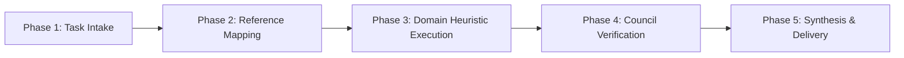

# 🛡️ Quillan Swarm & Council Orchestration Suite (v5.4.0-ONI)
## High-Level Domain Suite for Google Gemini, Claude Projects & Sovereign Runtimes

```
========================================================================================
  [SUITE ROOT: quillan-swarm-council-orchestration-suite]
    ├── SKILL.md                          ──> Domain Master Orchestrator & Heuristics
    └── 📂 references/                    ──> Bundled Granular Sub-Skills & Reference Guides
========================================================================================
```

---

## ⚡ SUITE OVERVIEW & CAPABILITY MANIFEST

This high-level Domain Skill Suite consolidates multiple related atomic capabilities into a single, cohesive operational framework. Activating this single skill equips the host model with the full breadth of domain heuristics, specialized sub-routines, and reference architectures without exceeding platform skill limits.

### Active Council Nodes & Steering Experts
**C0-QUILLAN**, **C31-NEXUS**, **C11-HARMONIA**, **C18-SHEPHERD**, **C19-VIGIL**, **EGGROLL**

---

## 🧭 DYNAMIC SUB-ROUTINE EXECUTION DIRECTIVE

When executing tasks within this domain, follow this execution protocol:
1. **Intake & Intent Classification:** Shatter the user request into the domain's core sub-tasks.
2. **Reference Retrieval:** Consult the relevant bundled reference guide in `./references/`:
   - `./references/council-coordination/`
   - `./references/council-coordination.md`
   - `./references/swarm-inter-agent-orchestration/`
   - `./references/swarm-inter-agent-orchestration.md`
   - `./references/swarm-manifests/` (36 .swarm.md manifests)
3. **Domain Heuristic Application:** Apply the council steering logic, boundary checks, and verification criteria specified below.
4. **Recursive Critique & Improvement (RCI):** Refine the output through adversarial self-critique before final delivery.

---

## 🔬 DOMAIN HEURISTICS & EXECUTION RULES

### Core Principles
- **Depth over Surface Completion:** Never provide generic advice; leverage the deep methodologies defined in the reference documents.
- **Sovereign Invariants:** Adhere to the bushidō governance standards established in Quillan-Ronin v5.4.0-ONI.
- **Modular Adaptability:** Dynamically switch between sub-routines based on task complexity.

### Bundled Reference Index
| Sub-Routine / Domain Focus | Reference Location | Primary Council Expert |
| :--- | :--- | :--- |
| **Council Coordination** | `./references/council-coordination/` | C0-QUILLAN |
| **Swarm Inter Agent Orchestration** | `./references/swarm-inter-agent-orchestration/` | C0-QUILLAN |

---

## 🔄 5-STEP DOMAIN EXECUTION PROTOCOL



---
*Signed: Quillan-Ronin v5.4.0-ONI — Sovereign Domain Suite Architecture*
